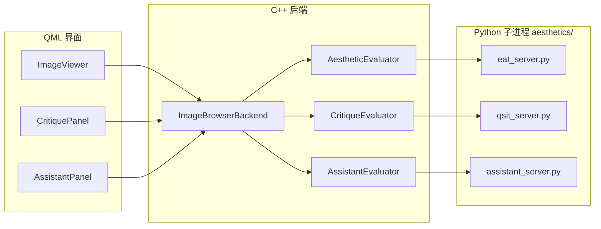

# ImageBrowser 项目说明文档

ImageBrowser 是一款基于 **Qt 5.15** 的沉浸式本地图片浏览器，采用 **C++ 后端 + QML 界面** 架构。除流畅的大图浏览、收藏筛选与导出外，还集成了三套本地 AI 能力：**EAT 美学评分**、**Q-SiT 摄影点评**、**小助理问答**——均可离线运行，无需联网。

<div align="center">
  <h3>✨ 沉浸式浏览体验</h3>
  
</div>

---

## 目录

- [1. 核心特性](#1-核心特性)
- [2. 完整下载与部署清单（）](#2-完整下载与部署清单)
- [3. 快速开始](#3-快速开始)
- [4. 界面与操作](#4-界面与操作)
- [5. AI 功能详解](#5-ai-功能详解)
- [6. 快捷键](#6-快捷键)
- [7. 技术栈与架构](#7-技术栈与架构)
- [8. 项目结构](#8-项目结构)
- [9. 下载与安装](#9-下载与安装)
- [10. 从源码构建](#10-从源码构建)
- [11. 自动化测试](#11-自动化测试)
- [12. 一键打包](#12-一键打包)
- [13. 配置参考](#13-配置参考)
- [14. 故障排查](#14-故障排查)
- [15. 版本历史](#15-版本历史)
- [16. 许可与联系](#16-许可与联系)

---

## 1. 核心特性

### 浏览与交互

| 特性 | 说明 |
|------|------|
| 沉浸式 UI | 顶部/底部工具栏采用悬浮岛屿式设计，最大化图片展示区域 |
| 异步加载 | 基于 `QtConcurrent` 解码大图，主线程不阻塞，切换带淡入动画 |
| 最近文件夹 | 自动记录最近 5 个文件夹，一键切换 |
| 浏览进度 | 按文件夹保存当前索引与文件名，重新打开可恢复位置 |
| 底部进度条 | 可拖拽 Slider 快速跳转到任意图片 |

### 收藏与导出

| 特性 | 说明 |
|------|------|
| 收藏标记 | 空格 / ↑ / ↓ / 右键切换收藏，顶部显示收藏数量 |
| 持久化 | 每个文件夹内生成 `favorites.txt`（UTF-8 文件名列表） |
| 一键导出 | 将收藏图片异步复制到导出目录（默认 `D:/收藏/<文件夹名>/`） |
| Toast 反馈 | 收藏/取消/导出完成均有色彩化即时提示 |

### 本地 AI（可选，需运行 `setup_aesthetics.bat`）

| 模块 | 入口 | 模型 | 输出 |
|------|------|------|------|
| **EAT 美学评分** | 图片左上角徽章 | [EAT](https://github.com/woshidandan/Image-Aesthetics-and-Quality-Assessment) | 1–10 分美学分数 |
| **Q-SiT 摄影点评** | 图片左下角「AI 点评」 | [Q-SiT-mini](https://huggingface.co/zhangzicheng/q-sit-mini) | 中文点评 + 质量分 |
| **小助理** | 右下角 💬 浮动按钮 | 内置 FAQ 知识库（可选 LLM） | 软件使用问答 |

> **评分说明**：左上角「美学」为 EAT 专用评分；点评面板内「AI 质量评分」来自 Q-SiT，两者模型不同，分数可能不一致。

### 工程质量

- **CMake** 构建，支持 Qt Creator / 命令行
- **71** 条自动化测试（C++ 后端 + QML 组件 + 键盘集成）
- GitHub Actions CI（Windows + Qt 5.15.2）
- 一键打包：便携目录 / ZIP / Inno Setup 安装包

---

## 2. 完整下载与部署清单（）

> 按你的使用场景选择路径。**仅浏览图片**只需前两行；**启用全部 AI 功能**请按顺序完成整张清单。

### 2.1 三种使用场景

| 场景 | 你需要做什么 | AI 是否可用 |
|------|--------------|-------------|
| **A. 安装包用户** | 下载 Setup.exe + VC++ 运行库 | 需额外执行 [2.4](#24-启用-ai-功能) |
| **B. 源码/便携包用户** | `git clone` → 构建 → 同 2.4 | 需额外执行 [2.4](#24-启用-ai-功能) |
| **C. 只要浏览** | 完成 A 或 B 的前半段即可 | 否（不影响看图、收藏、导出） |

### 2.2 主程序与系统依赖

| 序号 | 下载什么 | 从哪里下载 | 放到哪里 | 必填 |
|:----:|----------|------------|----------|:----:|
| ① | **ImageBrowser 安装包** | [GitHub Releases — ImageBrowser_v1.0.1_Setup.exe](https://github.com/vf2e/ImageBrowser/releases/download/V1.0.1/ImageBrowser_v1.0.1_Setup.exe) | 任意目录，双击安装 | 场景 A |
| ①′ | **或：源码仓库** | `git clone https://github.com/vf2e/ImageBrowser.git` | 如 `D:\opensource\ImageBrowser\` | 场景 B |
| ② | **Visual C++ 2019 运行库** | [Microsoft VC++ Redistributable (x64)](https://learn.microsoft.com/zh-cn/cpp/windows/latest-supported-vc-redist) | 系统级安装，无需手动放文件 | **是** |
| ③ | **Qt 5.15.2 MSVC2019 64-bit** | [Qt 官方离线安装器](https://download.qt.io/archive/qt/5.15/5.15.2/) | 仅**源码编译**需要，安装到如 `C:\qt5.15.2\` | 场景 B |
| ④ | **CMake 3.16+** | [cmake.org/download](https://cmake.org/download/) | 系统 PATH | 场景 B |
| ⑤ | **Visual Studio 2019/2022** | [Visual Studio](https://visualstudio.microsoft.com/)（勾选「使用 C++ 的桌面开发」） | 系统级安装 | 场景 B |

安装包用户运行后，程序位于类似：

```
C:\Program Files\ImageBrowser\ImageBrowser.exe
```

源码构建产物位于：

```
D:\opensource\ImageBrowser\build-release\ImageBrowser.exe
```

### 2.3 `aesthetics/` 目录必须与 exe 同级

程序从 **exe 所在目录向上查找** `aesthetics\` 文件夹。目录结构必须类似：

```
ImageBrowser.exe          ← 主程序
aesthetics\               ← 与 exe 同目录（或上级目录，开发时项目根即可）
├── eat_server.py
├── qsit_server.py
├── assistant_server.py
├── assistant_knowledge.md
├── config.json           ← setup 后自动生成
├── venv\                 ← setup 脚本创建
├── eat-repo\             ← setup 脚本 git clone
├── weights\              ← 你手动放入 .pth
└── hf_cache\             ← Q-SiT 首次使用时自动下载
```

| 安装方式 | `aesthetics\` 应在哪里 |
|----------|------------------------|
| **安装包** | `<安装目录>\aesthetics\`（安装包已复制脚本；venv/权重需自行 setup） |
| **源码开发** | 项目根目录 `ImageBrowser\aesthetics\`（与 `build-release\` 同级） |
| **便携包 `dist\`** | `dist\ImageBrowser\aesthetics\` |

> **常见启动失败原因**：只拷贝了 `ImageBrowser.exe`，没有旁边的 `aesthetics\` 和 Qt 运行库 DLL。请用 `pack.bat` 生成完整 `dist\`，或运行安装包。

---

### 2.4 启用 AI 功能

AI 模块依赖 **Python 虚拟环境 + EAT 源码 + 模型权重**。以下文件**不会**随 Git 仓库提供（体积过大，已在 `.gitignore` 中）。

#### 第一步：运行一键安装脚本（自动下载/安装）

| 序号 | 操作 | 说明 |
|:----:|------|------|
| ⑥ | 安装 **Git for Windows** | [git-scm.com/download/win](https://git-scm.com/download/win) |
| ⑦ | 安装 **Python 3.8+**（推荐 3.11） | [python.org/downloads](https://www.python.org/downloads/) — **勾选 “Add python.exe to PATH”** |
| ⑧ | 运行 setup 脚本 | 在**项目根目录**或**安装目录**执行：`scripts\setup_aesthetics.bat` |

脚本 **自动完成**（无需手动下载）：

| 自动获取的内容 | 来源 | 存放位置 |
|----------------|------|----------|
| EAT 官方源码 | [woshidandan/Image-Aesthetics-and-Quality-Assessment](https://github.com/woshidandan/Image-Aesthetics-and-Quality-Assessment) `git clone` | `aesthetics\eat-repo\` |
| Python 虚拟环境 | `python -m venv` | `aesthetics\venv\` |
| PyTorch + torchvision | PyTorch 官方 pip 源（有 NVIDIA 显卡时装 CUDA 版） | `aesthetics\venv\` 内 |
| EAT Python 依赖 | `aesthetics\requirements.txt` | `aesthetics\venv\` 内 |
| Q-SiT Python 依赖 | `aesthetics\requirements-qsit.txt` | `aesthetics\venv\` 内 |
| 默认配置文件 | 复制 `config.json.example` | `aesthetics\config.json` |

#### 第二步：手动下载 EAT 模型权重（必填，否则美学评分不可用）

从 EAT 官方 Google Drive 网盘下载 **AVA 数据集微调权重**：

| 项目 | 内容 |
|------|------|
| **下载页面** | [Google Drive — EAT 权重文件夹](https://drive.google.com/drive/folders/1UpLYGLU5omztVsIWkRPFTVKAOVe_4p3K?usp=sharing) |
| **必下文件** | `AVA_AOT_vacc_0.8259_srcc_0.7596_vlcc_0.7710.pth`（约 **333 MB**） |
| **存放路径** | `aesthetics\weights\AVA_AOT_vacc_0.8259_srcc_0.7596_vlcc_0.7710.pth` |
| **是否重命名** | **不需要**，保留原文件名即可 |

可选预训练权重（提升加载兼容性，非必须）：

| 项目 | 内容 |
|------|------|
| **文件名** | `dat_base_in1k_224.pth`（Google Drive 同文件夹，或 [百度网盘](https://pan.baidu.com/s/1kzXIp8V-QRSLOyRNMA-nUw?pwd=8888) 提取码 `8888`） |
| **存放路径** | `aesthetics\weights\pretrain.pth`（**需重命名**为 `pretrain.pth`） |
| **大小** | 约 **337 MB** |

> 网盘里还有 TAD66K、FLICKR-AES 等权重，ImageBrowser **只需 AVA 那一个**即可显示左上角美学分。

**权重目录最终应类似：**

```
aesthetics\weights\
├── AVA_AOT_vacc_0.8259_srcc_0.7596_vlcc_0.7710.pth   ← 必填
├── pretrain.pth                                       ← 可选
└── README.md
```

#### 第三步：Q-SiT 摄影点评（首次点击时自动下载）

| 项目 | 内容 |
|------|------|
| **模型名称** | Q-SiT-mini |
| **模型主页** | [HuggingFace — zhangzicheng/q-sit-mini](https://huggingface.co/zhangzicheng/q-sit-mini) |
| **下载方式** | 首次点击「AI 点评」时，程序自动从 HuggingFace 拉取 |
| **缓存位置** | `aesthetics\hf_cache\` |
| **体积** | 约 **1 GB**（视网络情况，国内可能较慢，可配置 HF 镜像） |
| **前置条件** | 已完成 [第一步 setup](#第一步运行一键安装脚本自动下载安装) |

#### 第四步：小助理（无需额外下载）

| 项目 | 内容 |
|------|------|
| **知识库** | 已随仓库提供 `aesthetics\assistant_knowledge.md` |
| **服务脚本** | 已随仓库提供 `aesthetics\assistant_server.py` |
| **可选 LLM** | 仅在 `config.json` 中填写 `assistant_model` 时才需从 HuggingFace 下载额外模型 |

---

### 2.5 依赖项目一览

ImageBrowser 本身 + 下列上游项目/组件：

| 依赖 | 用途 | 获取方式 |
|------|------|----------|
| **Qt 5.15.2** | 界面与运行时 | 安装包已内置；源码编译需自行安装 |
| **EAT** | 美学评分 | setup 脚本 `git clone` → `aesthetics\eat-repo\` |
| **PyTorch** | AI 推理后端 | setup 脚本 `pip install` → `aesthetics\venv\` |
| **Q-SiT-mini** | 摄影点评 | 首次使用自动下载 → `aesthetics\hf_cache\` |
| **transformers** 等 | Q-SiT / 小助理 LLM | setup 脚本 `pip install` |
| **Python 3.8+** | 运行 AI 服务 | 用户安装；setup 创建 venv |

上游开源仓库链接：

- EAT 论文与代码：https://github.com/woshidandan/Image-Aesthetics-and-Quality-Assessment
- Q-SiT-mini：https://huggingface.co/zhangzicheng/q-sit-mini

---

### 2.6 启动前自检清单

复制到本地，逐项打勾：

```text
[ ] 已安装 VC++ 2019 x64 运行库
[ ] ImageBrowser.exe 能正常打开并选择文件夹浏览图片

--- 以下仅启用 AI 时需要 ---

[ ] 已安装 Git 与 Python 3.8+（python.org 版，非 Store 占位符）
[ ] 已运行 scripts\setup_aesthetics.bat 且无报错
[ ] aesthetics\venv\Scripts\python.exe 存在
[ ] aesthetics\eat-repo\AVA\models 存在
[ ] aesthetics\weights\ 下有 AVA 微调 .pth（约 333 MB）
[ ] aesthetics\config.json 存在（setup 会自动复制 example）
[ ] （可选）NVIDIA 显卡 + CUDA 版 PyTorch：venv 中执行
      python -c "import torch; print(torch.cuda.is_available())" 输出 True
[ ] 打开含图片的文件夹，左上角出现「美学 x.xx」而非长期「未就绪」
[ ] （可选）首次 AI 点评需联网下载 Q-SiT 到 aesthetics\hf_cache\
[ ] 小助理（右下角 💬）无需额外模型即可 FAQ 问答
```

**快速验证 AI 环境：**

```bat
aesthetics\venv\Scripts\python.exe aesthetics\eat_server.py
```

若输出一行 `{"ready": true, ...}` 后等待 stdin，说明 EAT 服务正常。`Ctrl+C` 退出。

---

## 3. 快速开始

> 完整下载链接、放置路径、依赖说明见 **[第 2 章 完整下载与部署清单](#2-完整下载与部署清单)**。

### 仅浏览图片（无需 AI）

1. 下载 [安装包](https://github.com/vf2e/ImageBrowser/releases/download/V1.0.1/ImageBrowser_v1.0.1_Setup.exe) 并安装 [VC++ 运行库](https://learn.microsoft.com/zh-cn/cpp/windows/latest-supported-vc-redist)
2. 启动 `ImageBrowser.exe` → 选择图片文件夹

### 启用全部 AI 功能

```bat
scripts\setup_aesthetics.bat
```

然后从 [EAT Google Drive](https://drive.google.com/drive/folders/1UpLYGLU5omztVsIWkRPFTVKAOVe_4p3K?usp=sharing) 下载 `AVA_AOT_vacc_0.8259_srcc_0.7596_vlcc_0.7710.pth` 放入 `aesthetics\weights\`，重启程序。

Q-SiT 首次点击「AI 点评」自动下载；小助理开箱即用。

---

## 4. 界面与操作

```
┌─────────────────────────────────────────────────────────────┐
│  [美学 7.86]          ┌─ 顶部工具栏 ─┐                      │
│                       │ 📁 路径 ✨收藏 导出 │                  │
│                       └───────────────┘                      │
│                                                             │
│                      （全屏图片预览区）                        │
│                                                             │
│  [AI 点评]                              [💬 小助理]          │
│                       ┌─ 底部进度条 ─┐                      │
│                       │  3/120  ━━━●━━  快捷键提示  │        │
│                       └───────────────┘                      │
└─────────────────────────────────────────────────────────────┘
```

| 区域 | 功能 |
|------|------|
| 中央空白 / 📁 | 首次选文件夹；有历史记录时弹出最近列表 |
| 顶部工具栏 | 当前路径、收藏数、导出收藏 |
| 底部工具栏 | 页码计数、Slider 跳转、快捷键提示 |
| 左上角徽章 | EAT 美学评分（加载中显示「评分中…」） |
| 「AI 点评」 | 打开右侧点评侧栏（Q-SiT） |
| 右下角 💬 | 打开小助理对话窗口 |
| 侧栏 / 对话框 | 点击遮罩或 ✕ 关闭 |

**支持的图片格式**：`jpg` · `jpeg` · `png` · `bmp` · `gif` · `webp`

---

## 5. AI 功能详解

### 5.1 美学评分（EAT）

- **作用**：对当前图片给出 1–10 美学分数，显示在左上角
- **服务进程**：`aesthetics/eat_server.py`（JSON 行协议，长驻子进程）
- **C++ 桥接**：`AestheticEvaluator` → `ImageBrowserBackend`
- **缓存**：同一张图切换回来无需重新推理
- **权重**：`aesthetics/weights/*.pth`（见 [weights/README.md](aesthetics/weights/README.md)）

### 5.2 AI 摄影点评（Q-SiT-mini）

- **作用**：从构图、光影、色彩等角度生成 **250 字以内** 中文点评，并给出 Q-SiT 质量分
- **入口**：浏览图片时点击「AI 点评」，右侧滑出 `CritiquePanel`
- **服务进程**：`aesthetics/qsit_server.py`
- **C++ 桥接**：`CritiqueEvaluator` → `ImageBrowserBackend`
- **缓存**：同路径图片的点评文本与分数会缓存
- **性能参考**（RTX 4060 8GB + CUDA）：
  - 首次加载模型：约 20–30 秒
  - 之后每张：约 3–5 秒（含评分 + 文本生成两次推理）
  - CPU 模式会显著更慢

### 5.3 小助理 AI

- **作用**：回答关于 ImageBrowser 的使用问题（快捷键、安装、AI 模块、打包等）
- **入口**：右下角 💬 浮动按钮 → 居中对话框
- **服务进程**：`aesthetics/assistant_server.py`
- **知识库**：`aesthetics/assistant_knowledge.md`（FAQ 关键词匹配，**即时响应**）
- **可选 LLM**：在 `config.json` 配置 `assistant_model` 后，FAQ 未命中时可调用本地语言模型补充
- **对话**：支持多轮；「清空」重置会话；关闭软件后对话不保留

**内置常见问题快捷按钮**：

- 有哪些快捷键？
- 怎么收藏和导出？
- 美学评分怎么开启？
- AI 点评为什么很慢？

### 5.4 AI 架构概览



### 5.5 安装 AI 环境

> 逐步下载清单见 [2.4 启用 AI 功能](#24-启用-ai-功能)。

详细步骤见 [docs/aesthetics.md](docs/aesthetics.md)。

```bat
scripts\setup_aesthetics.bat
```

脚本会自动：

1. 克隆 EAT 官方仓库 → `aesthetics/eat-repo/`
2. 创建 Python 虚拟环境 → `aesthetics/venv/`
3. 安装 PyTorch、transformers 等依赖
4. 检测到 NVIDIA 显卡时尝试安装 **CUDA 版 PyTorch**

**权重目录**（不纳入 Git，需自行下载）：

| 文件 | 必填 | 说明 |
|------|------|------|
| `*.pth`（除 pretrain） | 是 | EAT AVA 微调 checkpoint |
| `pretrain.pth` | 否 | EAT 预训练权重 |

---

## 6. 快捷键

| 操作 | 按键 |
|------|------|
| 下一张 / 上一张 | `→` / `←` |
| 收藏 / 取消收藏 | `Space` · `↑` · `↓` |
| 快速翻页 | 鼠标滚轮 |
| 切换收藏 | 鼠标右键点击图片 |
| 拖拽跳转 | 底部 Slider |

> 小助理或 AI 点评面板打开时，方向键与空格 **不会** 触发图片操作，避免误触。

---

## 7. 技术栈与架构

### 技术栈

| 层级 | 技术 |
|------|------|
| 应用框架 | Qt 5.15.2 · C++11 |
| 界面 | QML 2.15 · QtQuick Controls 2 · QtGraphicalEffects |
| 并发 | QtConcurrent |
| AI 推理 | Python 3.8+ · PyTorch · transformers · EAT · Q-SiT |
| 构建 | CMake 3.16+ |
| 测试 | Qt Test · Qt Quick Test |
| 部署 | windeployqt · Inno Setup 6 |
| CI | GitHub Actions（Windows） |

### 架构分层

```
┌──────────────────────────────────────────┐
│  qml/main.qml          窗口组装、快捷键分发  │
├──────────────────────────────────────────┤
│  qml/components/       独立 UI 组件        │
│    ImageViewer / TopToolbar / ...        │
├──────────────────────────────────────────┤
│  ImageBrowserBackend   QML 可调用业务 API   │
│    ├─ AestheticEvaluator                 │
│    ├─ CritiqueEvaluator                  │
│    └─ AssistantEvaluator                 │
├──────────────────────────────────────────┤
│  Python 服务 (QProcess + JSON 行协议)      │
└──────────────────────────────────────────┘
```

- **C++ 后端**（`src/backend/`）：文件夹扫描、索引、收藏、进度、导出、AI 进程管理
- **QML 组件**（`qml/components/`）：纯 UI，通过全局 `backend` 对象通信
- **Python 服务**（`aesthetics/*_server.py`）：模型加载与推理，stdin/stdout JSON 通信

程序从 `exe` 所在目录向上查找 `aesthetics/` 文件夹（开发目录与打包后的 `dist` 目录均适用）。

---

## 8. 项目结构

```
ImageBrowser/
├── aesthetics/                      # AI 模块（setup 后含 venv、eat-repo）
│   ├── eat_server.py                # EAT 美学评分服务
│   ├── qsit_server.py               # Q-SiT 摄影点评服务
│   ├── assistant_server.py          # 小助理 FAQ / LLM 服务
│   ├── assistant_knowledge.md       # 小助理内置知识库
│   ├── requirements.txt             # EAT Python 依赖
│   ├── requirements-qsit.txt        # Q-SiT 额外依赖
│   ├── config.json.example          # 可选配置模板
│   ├── weights/                     # EAT 权重（本地，gitignore）
│   ├── venv/                        # Python 虚拟环境（gitignore）
│   ├── eat-repo/                    # EAT 源码 clone（gitignore）
│   └── hf_cache/                    # HuggingFace 模型缓存（gitignore）
├── src/
│   ├── main.cpp                     # 入口，注册 backend 到 QML
│   └── backend/
│       ├── ImageBrowserBackend.*    # 核心业务 + QML 属性
│       ├── AestheticEvaluator.*     # EAT 进程桥接
│       ├── CritiqueEvaluator.*      # Q-SiT 进程桥接
│       └── AssistantEvaluator.*     # 小助理进程桥接
├── qml/
│   ├── main.qml
│   └── components/
│       ├── ImageViewer.qml          # 图片预览 + 美学徽章 + AI 点评入口
│       ├── CritiquePanel.qml        # AI 摄影点评侧栏
│       ├── AssistantPanel.qml       # 小助理对话框
│       ├── AssistantFab.qml         # 小助理浮动按钮
│       ├── TopToolbar.qml
│       ├── BottomToolbar.qml
│       ├── EmptyPlaceholder.qml
│       ├── RecentFolderPopup.qml
│       ├── ToastMessage.qml
│       └── BackgroundGradient.qml
├── assets/
│   ├── icons/logo.ico
│   └── images/preview.png
├── docs/                            # 详细文档
├── tests/                           # 自动化测试
├── scripts/                         # 构建 / 测试 / 打包脚本
├── installer/ImageBrowser.iss       # Inno Setup 安装脚本
├── .github/workflows/ci.yml         # GitHub Actions
├── pack.bat                         # 打包快捷入口
├── CMakeLists.txt
└── qml.qrc
```

### 数据持久化（按文件夹）

| 文件 | 内容 |
|------|------|
| `<文件夹>/favorites.txt` | 收藏文件名列表（UTF-8） |
| `<文件夹>/browser_config.ini` | 上次浏览索引与文件名 |
| `%AppData%/WangChang/ImageBrowser/` | 最近文件夹列表（最多 5 条） |

---

## 9. 下载与安装

> **AI 权重、Python 环境、模型放置路径的完整说明** → 见 [第 2 章](#2-完整下载与部署清单)。

### 最新版本下载

[⬇️ 点击下载 ImageBrowser v1.0.1 安装包 (Windows)](https://github.com/vf2e/ImageBrowser/releases/download/V1.0.1/ImageBrowser_v1.0.1_Setup.exe)

> Release 安装包不含 AI 权重与 Python 环境。启用 AI 需在安装目录运行 `aesthetics\setup_aesthetics.bat`（或从源码复制已配置好的 `aesthetics\` 目录）。

### 环境要求

| 项目 | 要求 |
|------|------|
| 操作系统 | Windows 10 / 11 |
| 运行库 | [Visual C++ 2019 Redistributable](https://learn.microsoft.com/zh-cn/cpp/windows/latest-supported-vc-redist) |
| AI（可选） | Python 3.8+（setup 脚本自动创建 venv） |
| GPU 加速（可选） | NVIDIA 显卡 + CUDA 版 PyTorch |

### 安装步骤

1. 下载并运行 `ImageBrowser_v*_Setup.exe`
2. 按向导完成安装，可选创建桌面快捷方式
3. （可选）运行 `aesthetics\setup_aesthetics.bat` 并放入 EAT 权重
4. 从开始菜单或桌面启动

---

## 10. 从源码构建

### 开发环境

- Windows 10/11
- **Qt 5.15.2**（MSVC 2019 64-bit）
- **CMake 3.16+**
- Visual Studio 2019/2022（「使用 C++ 的桌面开发」工作负载）
- Qt Creator（推荐）
- Inno Setup 6（打包时需要）
- Git、Python 3.8+（AI 模块需要）

### 方式一：Qt Creator

```bat
git clone https://github.com/vf2e/ImageBrowser.git
cd ImageBrowser
```

1. 用 Qt Creator 打开 `CMakeLists.txt`
2. 选择 Kit：`Desktop Qt 5.15.2 MSVC2019 64bit`
3. 构建并运行

> QML 类型无法识别时，将 QML 导入路径设为项目下的 `qml/`。

### 方式二：命令行

```bat
scripts\build_release.bat
```

或手动：

```bat
set QT_DIR=C:\qt5.15.2\5.15.2\msvc2019_64
cmake -S . -B build-release -G "NMake Makefiles" -DCMAKE_BUILD_TYPE=Release -DCMAKE_PREFIX_PATH=%QT_DIR%
cmake --build build-release --config Release
```

产物：`build-release\ImageBrowser.exe`

### 手动部署 Qt 依赖

```bat
windeployqt --release --qmldir qml build-release\ImageBrowser.exe
```

> qmake → CMake 迁移记录：[docs/qmake-to-cmake-migration.md](docs/qmake-to-cmake-migration.md)

---

## 11. 自动化测试

项目包含 **三层测试，共 71 条用例**：

| 套件 | 框架 | 用例数 | 覆盖范围 |
|------|------|--------|----------|
| `tst_imagebrowserbackend` | Qt Test | 50 | 后端逻辑、收藏/导出/进度、AI mock、信号 |
| `tst_keyboard_integration` | Qt Test + QML | 4 | `main.qml` 快捷键与真实后端 |
| `tst_qml` | Qt Quick Test | 17 | QML 组件属性绑定 |

### 常用命令

```bat
scripts\run_tests.bat                    :: 运行全部测试
scripts\run_tests.bat --report           :: 测试 + 生成 HTML 报告
scripts\generate_test_report.bat --open  :: 构建、测试并打开报告
scripts\run_coverage.bat                 :: C++ 覆盖率（需 OpenCppCoverage）
```

成功时控制台显示 `[OK] All tests passed`。

### 文档索引

| 文档 | 内容 |
|------|------|
| [docs/testing.md](docs/testing.md) | 测试总览、运行方式速查、故障排查 |
| [docs/testing-testcases.md](docs/testing-testcases.md) | 全量用例明细 |
| [docs/testing-report.md](docs/testing-report.md) | HTML 报告生成 |
| [docs/coverage.md](docs/coverage.md) | 代码覆盖率 |
| [docs/development-log.md](docs/development-log.md) | 开发历程与技术决策 |

---

## 12. 一键打包

在项目根目录：

```bat
pack.bat
```

等价于 `scripts\package.bat`，自动完成：

1. **Release 构建** — 编译 `ImageBrowser.exe`
2. **依赖部署** — `windeployqt --qmldir qml`
3. **复制 AI 模块** — `eat_server.py`、`qsit_server.py`、`assistant_server.py`、知识库、权重（若存在）等
4. **便携 ZIP** — `output\ImageBrowser_v*_portable.zip`
5. **安装包** — Inno Setup 编译 `installer\ImageBrowser.iss`

### 输出目录

| 路径 | 说明 |
|------|------|
| `dist\ImageBrowser\` | 可直接运行的便携目录 |
| `output\ImageBrowser_v*_portable.zip` | 便携压缩包 |
| `output\ImageBrowser_v*_Setup.exe` | Windows 安装包 |

### 环境变量（可选）

```bat
set SKIP_BUILD=1       REM 跳过编译，仅重新部署/打包
set SKIP_INSTALLER=1   REM 不生成 Setup.exe
set SKIP_ZIP=1         REM 不生成便携 ZIP
set INCLUDE_VENV=1     REM 将 aesthetics\venv 打入 dist（体积很大，约 2GB+）
set QT_DIR=C:\qt5.15.2\5.15.2\msvc2019_64
pack.bat
```

Inno Setup 默认搜索路径：

- `C:\Program Files (x86)\Inno Setup 6\ISCC.exe`
- `C:\Program Files\Inno Setup 6\ISCC.exe`

---

## 13. 配置参考

复制 `aesthetics/config.json.example` 为 `aesthetics/config.json`（该文件已在 `.gitignore` 中，不会提交）。

```json
{
  "device": "cuda",
  "qsit_model": "zhangzicheng/q-sit-mini",
  "qsit_device": "cuda",
  "assistant_model": "",
  "assistant_device": "cuda",
  "assistant_use_llm": true,
  "assistant_max_tokens": 256
}
```

| 字段 | 适用模块 | 说明 |
|------|----------|------|
| `device` | EAT | 美学评分设备：`cuda` / `cpu` |
| `qsit_model` | Q-SiT | HuggingFace 模型 ID |
| `qsit_device` | Q-SiT | 点评模型设备 |
| `assistant_model` | 小助理 | 留空则仅 FAQ；如 `Qwen/Qwen2.5-0.5B-Instruct` |
| `assistant_device` | 小助理 | LLM 推理设备 |
| `assistant_use_llm` | 小助理 | 是否在 FAQ 未命中时调用 LLM |
| `assistant_max_tokens` | 小助理 | LLM 最大生成长度 |

### 环境变量（高级覆盖）

| 变量 | 说明 |
|------|------|
| `IMAGEBROWSER_PYTHON` | 指定 Python 可执行文件 |
| `IMAGEBROWSER_EAT_ROOT` | EAT 源码根目录 |
| `IMAGEBROWSER_EAT_WEIGHT` | EAT 权重路径 |
| `IMAGEBROWSER_EAT_DEVICE` | EAT 设备 |
| `IMAGEBROWSER_QSIT_MODEL` | Q-SiT 模型 ID |
| `IMAGEBROWSER_QSIT_DEVICE` | Q-SiT 设备 |

---

## 14. 故障排查

### 浏览与 UI

| 现象 | 处理 |
|------|------|
| 打不开文件夹 | 确认文件夹内有 jpg/png 等支持格式 |
| 进度未恢复 | 检查文件夹内是否有 `browser_config.ini` |

### AI 通用

| 现象 | 处理 |
|------|------|
| 提示运行 setup | 执行 `scripts\setup_aesthetics.bat` |
| 找不到 Python | 确认 `aesthetics\venv` 存在；或设置 `IMAGEBROWSER_PYTHON` |
| venv 创建失败 | 安装 [python.org](https://www.python.org/downloads/) 版 Python，避开 Microsoft Store 占位符 |

### EAT 美学评分

| 现象 | 处理 |
|------|------|
| 左上角「美学 未就绪」 | 检查权重是否在 `aesthetics\weights\` |
| 一直「评分中…」 | 首次加载模型较慢；检查 Python 进程是否崩溃 |
| CUDA 不生效 | 见下方 GPU 排查 |

### Q-SiT 摄影点评

| 现象 | 处理 |
|------|------|
| 首次很慢 / 下载失败 | 需联网；国内可设 HuggingFace 镜像后重试，如 `set HF_ENDPOINT=https://hf-mirror.com` |
| 点评失败 | 查看是否缺 transformers；重新运行 setup |
| 分数与 EAT 不一致 | **正常现象**，两者是不同模型 |

### 小助理

| 现象 | 处理 |
|------|------|
| 无法回答 | 确认 `assistant_server.py` 与 `assistant_knowledge.md` 在 `aesthetics\` 下 |
| 输入无响应 | 更新到最新版（已修复焦点冲突） |

### GPU / CUDA 排查

在 `aesthetics\venv` 中验证：

```bat
aesthetics\venv\Scripts\python.exe -c "import torch; print(torch.__version__, torch.cuda.is_available())"
```

- 若 `cuda_available` 为 `False`：当前是 CPU 版 PyTorch，需重装 CUDA 版
- 确认 `config.json` 中 `device` / `qsit_device` 为 `cuda`
- 重新运行 `scripts\setup_aesthetics.bat`（检测到 `nvidia-smi` 时会尝试安装 CUDA torch）

### Git 与大文件

模型权重（`.pth`）与 `venv/`、`hf_cache/` **不应提交到 Git**（已在 `.gitignore` 中）。若误提交大文件，可使用 `git filter-repo` 清理历史。

---

## 15. 版本历史

### v1.2.0（开发中）

- 新增 **小助理 AI**：FAQ 知识库 + 可选本地 LLM，对话式软件问答
- 新增 **Q-SiT 摄影点评**侧栏：中文点评 + 质量评分
- 集成 **EAT 美学评分**：左上角 1–10 分徽章
- AI 模块一键安装脚本 `setup_aesthetics.bat`
- 测试用例扩展至 71 条；`.gitignore` 优化（排除权重与 IDE 配置）

### v1.0.1

- 发布 Windows 安装包
- 文档与 README 更新

### v1.0.0（2024-03-03）

- 初始版本：沉浸式悬浮工具栏、收藏与导出、快捷键、异步加载

---

## 16. 许可与联系

### 许可协议

本项目采用 [MIT License](LICENSE) 开源协议。

### 开发者

- **作者**：Wang Chang
- **项目主页**：https://github.com/vf2e/ImageBrowser
- **问题反馈**：[GitHub Issues](https://github.com/vf2e/ImageBrowser/issues)

### 相关链接

| 资源 | 链接 |
|------|------|
| EAT 模型 | https://github.com/woshidandan/Image-Aesthetics-and-Quality-Assessment |
| Q-SiT-mini | https://huggingface.co/zhangzicheng/q-sit-mini |
| AI 接入详细文档 | [docs/aesthetics.md](docs/aesthetics.md) |

---

<p align="center">如果这个项目对你有帮助，欢迎 ⭐ Star</p>
