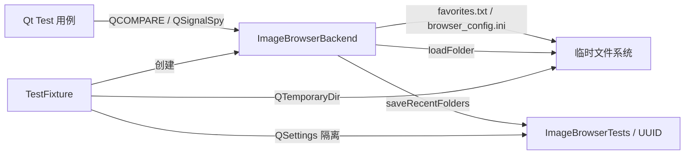
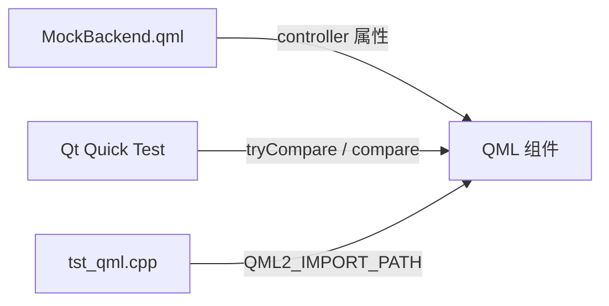

# ImageBrowser 测试文档

本文档说明项目的测试体系、运行方式、隔离策略与扩展指南。逐用例的断言细节见 [testing-testcases.md](testing-testcases.md)。

## 目录

- [概述](#概述)
- [运行方式速查](#运行方式速查)
- [测试架构](#测试架构)
- [快速开始（分步说明）](#快速开始分步说明)
- [测试套件一览](#测试套件一览)
- [隔离与环境](#隔离与环境)
- [TestFixture 参考](#testfixture-参考)
- [编写新用例](#编写新用例)
- [CI 集成](#ci-集成)
- [HTML 测试报告](#html-测试报告)
- [故障排查](#故障排查)
- [覆盖率与缺口](#覆盖率与缺口)

---

## 概述

ImageBrowser 采用 **三层测试**（C++ 单元 + 键盘集成 + QML 组件）：

| 层级 | 框架 | 目标 | 用例数 |
|------|------|------|--------|
| C++ 单元测试 | Qt Test | `ImageBrowserBackend` 业务逻辑 | 48 |
| QML 组件测试 | Qt Quick Test | UI 组件与 `controller` 绑定 | 17 |
| 键盘集成测试 | Qt Test + QML Harness | `main.qml` 快捷键逻辑 | 4 |

测试默认随主工程一起构建（`IMAGEBROWSER_BUILD_TESTS=ON`），可通过 CTest 或 `scripts/run_tests.bat` 一键执行。

---

## 运行方式速查

> **防忘备忘**：日常开发优先用「一键运行」；需要留档或分享结果时用「HTML 报告」；改 C++ 后端逻辑后用「覆盖率」。

### 命令一览

| 我想… | 命令 | 说明 |
|--------|------|------|
| 跑完全部测试 | `scripts\run_tests.bat` | 最常用；自动配置、编译、运行三套套件 |
| 跑测试并生成 HTML 报告 | `scripts\run_tests.bat --report` | 同上，额外生成可读报告 |
| 构建 + 测试 + 打开报告 | `scripts\generate_test_report.bat --open` | 独立脚本，适合只想看报告 |
| 只根据已有结果重新出报告 | `scripts\generate_test_report.bat --html-only --open` | 需先有 `build-release/tests/reports/*.xml` |
| 生成 C++ 代码覆盖率 | `scripts\run_coverage.bat` | 需安装 OpenCppCoverage，见 [coverage.md](coverage.md) |
| 用 CTest 跑（接近 CI） | `cd build-release` 然后 `ctest -C Release --output-on-failure` | 需先完成 CMake 配置与编译 |
| 只跑某一个用例 | 见下方 [单用例 / 单套件](#单用例--单套件) | 调试失败时 |

### 成功时你会看到

```
[OK] All tests passed
```

退出码为 `0`。若失败，退出码为 `1`，控制台会标出 `FAIL!` 行。

### 输出文件位置

| 类型 | 路径 |
|------|------|
| 文本结果（三套） | `build-release/tests/test-result-backend.txt` |
| | `build-release/tests/test-result-qml.txt` |
| | `build-release/tests/test-result-keyboard.txt` |
| JUnit XML（`--report` 时） | `build-release/tests/reports/backend.xml` 等 |
| HTML 测试报告 | `build-release/test-report/index.html` |
| 覆盖率 HTML | `coverage-report/backend/index.html` |

用资源管理器双击 `index.html` 即可在浏览器中查看报告。

### 环境要求（脚本已自动处理）

| 项目 | 说明 |
|------|------|
| Qt | `QT_DIR` 指向 Qt 5.15.2 MSVC 64-bit；未设置时脚本会尝试 `C:\qt5.15.2\...` 或 `C:\Qt\5.15.2\...` |
| Visual Studio | 需已安装 VS 2019/2022；脚本会调用 `vcvars64.bat` |
| `PATH` | 必须含 `%QT_DIR%\bin`，否则退出码 `0xC0000135`（缺 DLL） |
| QML / 后端测试 | `QT_QPA_PLATFORM=offscreen`（`run_tests.bat` 已设置） |
| 键盘集成测试 | `QT_QPA_PLATFORM=windows`（`run_tests.bat` 跑键盘套件时会切换） |

手动跑测试前，可先执行：

```bat
set QT_DIR=C:\qt5.15.2\5.15.2\msvc2019_64
set PATH=%QT_DIR%\bin;%PATH%
set QT_PLUGIN_PATH=%QT_DIR%\plugins
```

### 单用例 / 单套件

在 **`build-release\tests`** 目录下执行（确保 `PATH` 含 Qt）：

```bat
cd build-release\tests

:: 只跑后端某一个用例
tst_imagebrowserbackend.exe recentFolders_deduplicatesExistingEntry -o -,txt

:: 只跑整个后端套件
tst_imagebrowserbackend.exe -o test-result-backend.txt,txt

:: 只跑 QML 套件（需 offscreen）
set QT_QPA_PLATFORM=offscreen
tst_qml.exe -o test-result-qml.txt,txt

:: 只跑键盘集成（需 windows 平台）
set QT_QPA_PLATFORM=windows
tst_keyboard_integration.exe -o test-result-keyboard.txt,txt
```

输出到控制台：`-o -,txt`；写入文件：`-o 文件名.txt,txt`。

同时输出 JUnit XML（供报告脚本使用）：

```bat
tst_imagebrowserbackend.exe -o reports\backend.xml,junitxml -o test-result-backend.txt,txt
```

### 典型工作流

```
改完 C++ 后端代码
  → scripts\run_tests.bat
  → 失败则 cd build-release\tests，单用例调试
  → 全部通过后可选 scripts\run_tests.bat --report 留档

改完 QML 组件
  → scripts\run_tests.bat（或只跑 tst_qml.exe）
  → 参考 test-result-qml.txt 里的 FAIL 行

发版 / 自查覆盖
  → scripts\run_coverage.bat
  → 打开 coverage-report\backend\index.html
```

### 相关文档

| 文档 | 内容 |
|------|------|
| [testing-report.md](testing-report.md) | HTML 报告原理、CI 上传、报告故障排查 |
| [testing-testcases.md](testing-testcases.md) | 69 条用例明细与断言 |
| [coverage.md](coverage.md) | 覆盖率脚本与 OpenCppCoverage |

---

## 测试架构

```
tests/
├── CMakeLists.txt                 # 注册 tst_imagebrowserbackend、tst_qml
├── TestFixture.h                  # C++ 测试夹具（临时目录 + 隔离 QSettings）
├── tst_imagebrowserbackend.cpp    # 后端单元测试
├── tst_qml.cpp                    # QML 测试入口（配置 import 路径）
└── qml/
    ├── MockBackend.qml            # 轻量 controller mock
    ├── tst_emptyplaceholder.qml
    ├── tst_toptoolbar.qml
    ├── tst_bottomtoolbar.qml
    └── tst_toastmessage.qml
```

### 数据流（C++ 测试）



### 数据流（QML 测试）



QML 测试**不启动完整 ApplicationWindow**，通过 `createTemporaryObject` 动态加载组件，配合 `MockBackend` 验证 `controller` 绑定逻辑。

> **说明**：组件使用 `layer.effect`（DropShadow）时，headless（`QT_QPA_PLATFORM=offscreen`）环境下 `visible` 属性可能不可靠。测试改为断言与 `visible` 等价的绑定表达式（如 `imageCount === 0`、`imageCount > 0`），详见 [testing-testcases.md](testing-testcases.md#qml-组件测试tst_qml)。

---

## 快速开始（分步说明）

> 命令速查见上一节 [运行方式速查](#运行方式速查)。

### 一键运行（推荐）

```bat
scripts\run_tests.bat
```

脚本依次完成：

1. 检测 `QT_DIR`、加载 Visual Studio 环境（`vcvars64.bat`）
2. CMake 配置 `build-release`（`-DIMAGEBROWSER_BUILD_TESTS=ON`）
3. 编译 `tst_imagebrowserbackend`、`tst_qml`、`tst_keyboard_integration`
4. 运行三套测试，结果写入 `build-release/tests/test-result-*.txt` 并打印到控制台

带 HTML 报告：

```bat
scripts\run_tests.bat --report
```

### 手动：配置与编译

```bat
set QT_DIR=C:\qt5.15.2\5.15.2\msvc2019_64
set PATH=%QT_DIR%\bin;%PATH%
set QT_PLUGIN_PATH=%QT_DIR%\plugins

cmake -S . -B build-release -G "NMake Makefiles" ^
  -DCMAKE_BUILD_TYPE=Release ^
  -DCMAKE_PREFIX_PATH=%QT_DIR% ^
  -DIMAGEBROWSER_BUILD_TESTS=ON

cmake --build build-release --target tst_imagebrowserbackend tst_qml tst_keyboard_integration
```

### 手动：运行三套测试

```bat
cd build-release\tests
set QT_QPA_PLATFORM=offscreen

tst_imagebrowserbackend.exe -o test-result-backend.txt,txt
tst_qml.exe -o test-result-qml.txt,txt

set QT_QPA_PLATFORM=windows
tst_keyboard_integration.exe -o test-result-keyboard.txt,txt
```

> **注意**：运行测试前需将 `%QT_DIR%\bin` 加入 `PATH`，否则 Windows 会因缺少 Qt DLL 返回 `0xC0000135`。

### CTest

```bat
cd build-release
ctest -C Release --output-on-failure
```

### 关闭测试构建

```bat
cmake -B build-release -DIMAGEBROWSER_BUILD_TESTS=OFF
```

---

## 测试套件一览

### C++：`tst_imagebrowserbackend`（48 用例）

| 模块 | 数量 | 说明 |
|------|------|------|
| 初始状态 | 2 | 构造后空列表、空路径 |
| 文件夹加载 | 6 | 扩展名过滤、空目录、不存在目录 |
| 索引与导航 | 8 | 边界、循环、空目录无操作 |
| 收藏 | 6 | 增删、消息类型、`isCurrentFavorite` |
| 收藏持久化 | 4 | UTF-8 文件、重载、缺失项、中文名 |
| 浏览进度 | 3 | `browser_config.ini` 读写与恢复策略 |
| 最近目录 | 4 | 前置、去重、上限 5、跨实例 QSettings |
| 导出 | 4 | 空收藏、复制、跳过已存在、异步完成 |
| 信号 | 5 | 加载/切换/收藏状态/最近目录信号 |
| selectFolder | 2 | 注入式目录选择器 |
| 多收藏与隔离 | 2 | 多图收藏、相册间隔离 |
| 导出异常 | 1 | `mkpath` 失败 |
| 集成工作流 | 1 | 加载→导航→收藏→导出→重载 |

完整用例表、前置条件与断言见 [testing-testcases.md](testing-testcases.md)。

### 键盘集成：`tst_keyboard_integration`（4 用例）

加载 `tests/qml/KeyboardHarness.qml`（与 `main.qml` 相同的 `Keys.onPressed` 逻辑），注入真实 `ImageBrowserBackend`，用 `QTest::keyClick` 验证 ←→、Space、无效键。

> 需在 `QT_QPA_PLATFORM=windows` 下运行（`run_tests.bat` 已配置）。

### QML：`tst_qml`（17 用例）

| 文件 | 用例 | 验证点 |
|------|------|--------|
| `tst_emptyplaceholder.qml` | 3 | 无图时显示、有图时隐藏、读取 `recentFolders` |
| `tst_toptoolbar.qml` | 2 | 无图隐藏、有图显示路径与收藏数 |
| `tst_bottomtoolbar.qml` | 2 | 无图隐藏、索引/总数绑定 |
| `tst_toastmessage.qml` | 3 | `show()` 消息、`info`/`fav`/`unfav` 类型 |
| `tst_imageviewer.qml` | 3 | 路径/数量绑定、收藏角标、无图状态 |
| `tst_recentfolderpopup.qml` | 2 | 最近列表绑定、空列表 |
| `tst_backgroundgradient.qml` | 2 | 组件加载、渐变 stop 数量 |

---

## 隔离与环境

为避免污染用户真实数据，测试环境与生产环境严格分离：

| 项目 | 生产环境 | 测试环境 |
|------|----------|----------|
| QSettings 组织名 | `WangChang` | `ImageBrowserTests` |
| QSettings 应用名 | `ImageBrowser` | 每用例唯一 key（默认 UUID） |
| 导出根目录 | `D:/收藏` | `{临时目录}/exports/` |
| 相册数据 | 用户文件夹 | `QTemporaryDir`（进程结束自动清理） |
| 收藏日志 | `{相册}/favorites.txt` | 临时目录内 |
| 浏览进度 | `{相册}/browser_config.ini` | 临时目录内 |

### 后端可注入接口（仅测试使用）

构造函数支持自定义 settings 作用域：

```cpp
ImageBrowserBackend(nullptr, "ImageBrowserTests", settingsKey);
```

运行时还可调用：

- `setSettingsScope(organization, application)` — 切换 QSettings 作用域
- `setExportDestRoot(root)` — 重定向导出目录
- `setFolderPicker(callback)` — 测试时替换 `QFileDialog`

生产代码 `main.cpp` 仍使用默认参数，行为不变。

### 跨实例持久化注意点

复用同一 `settingsKey` 验证 QSettings 持久化时，**第二个** `TestFixture` 必须传入 `clearSettings = false`：

```cpp
TestFixture fixture(settingsKey);           // 清空后写入
TestFixture fixture2(settingsKey, false);   // 保留已有数据
```

否则构造时的 `settings.clear()` 会抹掉前一个实例的写入。

---

## TestFixture 参考

`tests/TestFixture.h` 封装每次用例的公共环境。

### 构造

```cpp
TestFixture(const QString &settingsKey = QString(),
            bool clearSettings = true);
```

| 参数 | 默认 | 说明 |
|------|------|------|
| `settingsKey` | `UnitTest_{UUID}` | QSettings 应用名 |
| `clearSettings` | `true` | 是否在构造时 `QSettings::clear()` |

### 常用方法

| 方法 | 返回 | 说明 |
|------|------|------|
| `isValid()` | `bool` | 临时目录是否创建成功 |
| `backend()` | `ImageBrowserBackend*` | 被测后端实例 |
| `rootPath()` | `QString` | 临时根目录 |
| `createFolder(name)` | `QString` | 创建子目录并返回绝对路径 |
| `createImageFile(folder, name, content)` | `QString` | 写入假图片文件 |
| `writeTextFile(folder, name, content)` | `QString` | 写入文本文件 |
| `fileExists(path)` | `bool` | 检查文件存在 |
| `readTextFile(path)` | `QString` | 读取 UTF-8 文本 |

### 典型用法

```cpp
void TestImageBrowserBackend::example()
{
    TestFixture fixture;
    QVERIFY(fixture.isValid());

    const QString folder = fixture.createFolder(QStringLiteral("album"));
    fixture.createImageFile(folder, QStringLiteral("a.jpg"));

    fixture.backend()->loadFolder(folder);
    QCOMPARE(fixture.backend()->totalCount(), 1);
}
```

---

## 编写新用例

### C++ 后端用例

1. 在 `tst_imagebrowserbackend.cpp` 的 `private slots` 中声明 `void myFeature_doesSomething();`
2. 实现函数，优先使用 `TestFixture` + `QCOMPARE` / `QVERIFY` / `QSignalSpy`
3. 异步逻辑使用 `QTRY_COMPARE_WITH_TIMEOUT`（参考导出用例）
4. 在 [testing-testcases.md](testing-testcases.md) 补充用例说明
5. 运行 `scripts\run_tests.bat` 验证

### QML 组件用例

1. 在 `tests/qml/` 新增 `tst_<component>.qml`，根节点为 `TestCase`
2. 使用 `MockBackend` 或扩展其属性模拟 controller 状态
3. 通过 `import "components"` 加载 `qml/components/` 下组件
4. 构建后 `tst_qml` 目标会自动将 `tests/qml/` 复制到 `build-*/tests/tst_qml/`
5. 运行 `tst_qml.exe -o -,txt`

### 命名约定

```
<模块>_<场景>_<预期行为>
```

示例：`loadFolder_nonexistentFolder_emitsMessageAndRemovesFromRecent`

---

## CI 集成

仓库包含 GitHub Actions 工作流 `.github/workflows/ci.yml`：

- 触发：`push` / `pull_request` 到 `main` 或 `master`
- 环境：`windows-latest` + Qt 5.15.2 (MSVC 2019 64-bit)
- 步骤：CMake 配置 → 编译测试 → `ctest --output-on-failure`

本地模拟 CI：

```bat
cmake -S . -B build -G "NMake Makefiles" -DCMAKE_BUILD_TYPE=Release -DIMAGEBROWSER_BUILD_TESTS=ON
cmake --build build
cd build && ctest -C Release --output-on-failure
```

---

## HTML 测试报告

除控制台文本与 `test-result*.txt` 外，可生成**结构化 HTML 报告**（通过率、分套件卡片、失败摘要、用例搜索）。

| 场景 | 命令 |
|------|------|
| 跑测试 + 出报告 | `scripts\run_tests.bat --report` |
| 独立脚本（含编译） | `scripts\generate_test_report.bat` |
| 生成后自动打开浏览器 | 上述任一脚本加 `--open`，或 `generate_test_report.bat --open` |
| 仅重新渲染 HTML | `scripts\generate_test_report.bat --html-only --open` |

报告路径：`build-release/test-report/index.html`。详细说明见 [testing-report.md](testing-report.md)。

---

## 故障排查

| 现象 | 可能原因 | 处理 |
|------|----------|------|
| 退出码 `0xC0000135` | 找不到 Qt DLL | 将 `%QT_DIR%\bin` 加入 `PATH` |
| `nmake` 不是内部命令 | 未加载 VS 环境 | 先执行 `vcvars64.bat` 或使用 `run_tests.bat` |
| 控制台无测试输出 | `-o -,txt` 在部分终端不显示 | 查看 `build-release/tests/test-result*.txt` |
| `recentFolders` 断言失败 | settings 被后续 fixture 清空 | 跨实例测试使用 `clearSettings=false` |
| 导出测试超时 | 线程池繁忙 | 增大 `QTRY_COMPARE_WITH_TIMEOUT` 超时 |
| QML 测试 `module not found` | import 路径错误 | 确认 `QML_IMPORT_ROOT` 指向项目 `qml/`，且 `QT_QML_IMPORT_PATH` 含 Qt 安装目录 |
| QML 测试找不到数据目录 | `QUICK_TEST_SOURCE_DIR` 路径错误 | CMake 已用正斜杠写入宏；重新配置并构建 `tst_qml` |
| QML `visible` 断言失败 | offscreen 下 layer.effect 干扰 | 断言 `imageCount` 等绑定源，见用例文档 |
| QML 测试无输出即退出 | 缺少 `QT_PLUGIN_PATH` | 设置 `%QT_DIR%\plugins`，`run_tests.bat` 已自动配置 |

### 调试单个失败用例

```bat
tst_imagebrowserbackend.exe exportFavorites_copiesFilesToDestination -o debug.txt,txt
type debug.txt
```

---

## 覆盖率与缺口

### 已覆盖

- `ImageBrowserBackend` 全部公开业务路径（含注入式 `selectFolder`）
- 主要 QML 组件的 `controller` 绑定与可见性
- 文件持久化（`favorites.txt`、`browser_config.ini`、QSettings `RecentFolders`）
- 异步导出与 `QSignalSpy` 信号验证

### 未覆盖 / 建议补充

| 项目 | 原因 | 建议 |
|------|------|------|
| `selectFolder()` 真实对话框 | 需人工点击 | 逻辑已用 `setFolderPicker` 单测；GUI 建议手工冒烟 |
| `Image` 解码与动画 | 需真实图片与 GPU | 手工或截图对比 |
| `BackgroundGradient` | 纯视觉 | 快照测试或人工回归 |
| 键盘快捷键 (`main.qml`) | 需焦点与窗口事件 | `QTest::keyClick` 集成测试 |
| 安装包 / `windeployqt` | 部署流程 | 发布流水线 smoke test |
| 大目录性能 | 非功能测试 | 基准测试 / 压力测试 |

---

## 相关文档

- [testing-report.md](testing-report.md) — HTML 测试报告生成
- [testing-testcases.md](testing-testcases.md) — 全量用例明细
- [coverage.md](coverage.md) — C++ 覆盖率报告
- [qmake-to-cmake-migration.md](qmake-to-cmake-migration.md) — 构建系统迁移记录
- [development-log.md](development-log.md) — 项目开发日志
